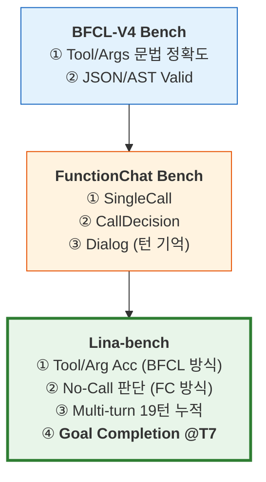

# 벤치마크 비교 — BFCL · FunctionChat · Lina-bench

> **[Lina-bench]는 [BFCL][bfcl-repo]과 [FunctionChat][fc-repo]의 평가 요소를 결합하고, 멀티턴 세션 완주까지 측정하는 상위 벤치마크임.**

---

## 1. 벤치마크 포함 관계



[BFCL][bfcl-repo]은 **문법 정확도**, [FunctionChat][fc-repo]은 **턴별 행동 판단**, [Lina-bench]는 **멀티턴 세션 완주**를 측정함.
BFCL의 호출 정밀도와 FunctionChat의 판단 평가를 결합한 뒤, 멀티턴 누적·스트레스·붕괴 진단을 추가한 것이 Lina-bench임.

---

## 2. 한 줄 비교

| 벤치마크 | 한 줄 정의 | 비유 |
|----------|-----------|------|
| **BFCL** | 함수 호출을 **문법적으로** 맞췄는가 | 운전면허 필기시험 |
| **FunctionChat** | 이번 턴에 **tool 판단**을 잘했는가 | 운전면허 기능시험 |
| **Lina-bench** | 업무를 **끝까지 완주**했는가 | 실제 도로 주행시험 |

---

## 3. 지표 포함 여부

| 평가 요소 | BFCL | FunctionChat | **Lina-bench** |
|-----------|:----:|:------------:|:--------------:|
| Tool name 정확 | ✅ | ✅ | ✅ |
| Args 정확 (AST 매칭) | ✅ | △ ¹ | ✅ |
| Call / No-Call 판단 | ❌ | ✅ | ✅ |
| 한국어 답변 품질 | ❌ | ✅ | ✅ |
| Parallel Call | ✅ | — | ✅ |
| Multi-turn 기억 | △ ² | ⚠️ 일부 | ✅ (19턴) |
| 스트레스 테스트 (3축) | ❌ | ❌ | ✅ |
| 업무 완주율 (@T7) | ❌ | ❌ | ✅ |
| 붕괴 지점 진단 | ❌ | ❌ | ✅ |
| 에러 유형 분류 (6-tag) | ❌ | ❌ | ✅ |

> ¹ FunctionChat은 Call 유형에서 인자 Key/Value 일치를 Pass 기준으로 평가하나, AST 수준의 정밀 매칭은 아님 ([원본 논문][fc-paper]).
> ² [BFCL v4][bfcl-leaderboard] 프레임워크 자체는 multi-turn을 지원하나, 본 프로젝트에서 실행한 BFCL 평가는 싱글턴만 수행함.

BFCL은 싱글턴 호출 정밀도, FunctionChat은 턴별 행동 판단에 집중함.
Lina-bench는 이 둘을 결합한 뒤, 멀티턴 누적 + 스트레스 + 완주율까지 커버함.

---

## 4. 모델별 벤치마크 결과 교차 비교

### 4.1 [BFCL-V4][bfcl-repo] 결과 (싱글턴 문법 정확도)

| 모델 | Simple | Multiple | Parallel | Parallel Multiple | **평균** |
|------|--------|----------|----------|-------------------|---------|
| **Qwen3-14B** | 95.0 | 95.5 | 93.0 | 96.0 | **94.9%** |
| Qwen3-Next-80B | 96.8 | 95.0 | 93.5 | 92.0 | 94.3% |
| Qwen3-32B | 93.5 | 89.0 | 89.0 | 93.0 | 91.1% |
| Mistral-Small-24B | 57.8 | 63.0 | 40.5 | 40.0 | 50.3% |
| Llama-3.3-70B | 26.3 | 14.5 | 32.0 | 4.0 | 19.2% |

BFCL 기준으로는 **Qwen3-14B (94.9%)** 가 1위임. 싱글턴 문법 정확도는 높음.

### 4.2 [FunctionChat][fc-repo] 결과 (턴별 행동 판단)

| 모델 | Dialog (200) | SingleCall (500) | CallDecision (606) | **Accuracy** |
|------|:------------:|:----------------:|:------------------:|:------------:|
| Qwen3-32B | 47.5% | **85.8%** | 31.7% | **54.8%** |
| Qwen3-Next-80B | 42.5% | 80.0% | 32.7% | 52.3% |
| **Qwen3-14B** | 42.0% | 80.6% | 30.7% | **51.5%** |
| Llama-3.3-70B | **48.0%** | 41.6% | 10.7% | 28.3% |
| Mistral-Small-24B | 47.0% | 16.0% | 31.7% | 28.0% |

FunctionChat에서는 **Qwen3-32B (54.8%)** 가 1위이고, 14B는 3위임.
CallDecision이 대부분 30%대(Llama는 10.7%)로, 호출/미호출 판단 자체가 어려운 과제임.

### 4.3 [Lina-bench] 결과 (전체 T19 기준 지표 + @T7 실무 Performance)

| 모델 | Tool ³ | Arg ³ | FC ³ | NL ³ | **실무 Perf (@T7)** | 전체 Perf (T19) |
|------|:------:|:-----:|:----:|:----:|:------------------:|:---------------:|
| **Qwen3-14B** | **84%** | **62%** | **89%** | **100%** | **79%** | 77% |
| Qwen3-Next-80B | 77% | 59% | 86% | 26% | 77% | 75% |
| Qwen3-32B | 75% | 58% | 84% | 83% | 75% | 72% |
| Llama-3.3-70B | 86% | 36% | 84% | 0% | 68% | 67% |
| Mistral-Small-24B | 9% | 7% | 45% | 32% | 26% | 27% |

> ³ Tool/Arg는 tool_call 턴(94턴), FC는 전체 턴(106턴) 기준 T19 누적 수치임. @T7 실무 기준 세부는 아래 참고.
>
> qwen3-14b @T7: Tool 88%, Arg 74%, FC 94%, No-Call 44% → Performance **79%**

Lina-bench 실무(@T7) 기준으로는 **Qwen3-14B (79%)** 가 1위임.
2위 Qwen3-Next-80B (77%), 3위 Qwen3-32B (75%)와 각각 2%p, 4%p 차이임.
상세 데이터는 [텍스트 리포트](results/report_20260209_105911.txt) · [Markdown 리포트](results/report_20260209_105911.md) 참고.

---

## 5. 같은 모델, 다른 점수 — 왜?

### Qwen3-14B의 3개 벤치마크 점수

| 벤치마크 | 점수 | 무엇을 측정했나 |
|----------|:----:|----------------|
| **BFCL** | **94.9%** | 싱글턴에서 tool/args JSON을 맞췄는가 |
| **FunctionChat** | **51.5%** | 이번 턴에 호출/미호출/질문을 잘 판단했는가 |
| **Lina-bench** | **79%** (@T7) | 7턴 멀티턴에서 업무를 완주했는가 |

```
점수가 다른 이유:

  BFCL 94.9%    ← 싱글턴이라 맥락 기억 불필요, 문법만 맞으면 됨
       ↓
  FunctionChat 51.5%  ← CallDecision(호출 판단)이 추가되면서 30%대로 하락
       ↓
  Lina-bench 79%  ← 7턴 연속 세션에서 Tool+Arg+FC를 동시에 맞춰야 함
                     BFCL 문법력(94.9%)과 FunctionChat 판단력(상위)이
                     결합되어, 멀티턴에서도 79%를 유지한 결과임
```

### 벤치마크별 순위 변동

| 모델 | BFCL 순위 | FunctionChat 순위 | Lina-bench 순위 | 요약 |
|------|:---------:|:-----------------:|:--------------:|------|
| **Qwen3-14B** | **1위** (94.9%) | 3위 (51.5%) | **1위** (79%) | 문법+판단 모두 상위 → 완주 |
| Qwen3-Next-80B | 2위 (94.3%) | 2위 (52.3%) | 2위 (77%) | 안정적이나 NL 26%로 답변 생성 약함 |
| Qwen3-32B | 3위 (91.1%) | **1위** (54.8%) | 3위 (75%) | 판단 1위이나 Arg 정밀도에서 차이 |
| Llama-3.3-70B | 5위 (19.2%) | 4위 (28.3%) | 4위 (68%) | 기초(BFCL) 부족이 실무에 직결 |
| Mistral-Small-24B | 4위 (50.3%) | 5위 (28.0%) | 5위 (26%) | 전 영역 부족 |

BFCL 1위가 반드시 Lina 1위인 것은 아님. 다만 BFCL이 낮으면(Llama 19.2%) 실무에서도 낮음(68%).
Qwen3-14B는 **기초(BFCL 1위) + 판단(FunctionChat 상위)** 이 결합되어 실무(Lina 1위)로 이어진 경우임.

---

## 6. Qwen3-14B가 1위인 근거

**Qwen3-14B는 BFCL(94.9%)과 FunctionChat(상위)을 모두 통과하면서, Lina-bench @T7에서 가장 높은 Performance(79%)를 기록한 모델임.**

| 근거 | 수치 |
|------|------|
| BFCL 싱글턴 정확도 | **94.9%** (5모델 중 1위) |
| FunctionChat 판단 | 51.5% (상위 그룹, 3위) |
| Lina @T7 실무 Performance | **79%** (5모델 중 1위) |
| Lina @T3 초반 | 89% (T3까지 85%+ 유지) |
| NL Quality | **100%** (Agent + 답변 겸용 가능) |
| H100 80GB FP16 서빙 | ~28GB (52GB 여유) |

Lina-bench에서만 확인 가능한 진단 결과:
- **붕괴 시점**: T3까지 89% → T5에서 80%로 하락 → T7에서 79% 안착
- **최약 스트레스**: ST1(조건누적) 73% — 조건이 쌓이면 인자를 잊음
- **최강 스트레스**: ST3(교란주입) 82% — tool 과잉 성향이 오히려 유리
- **에러 유형**: ARG_WRONG 24건 > WRONG_TOOL 18건 — 도구는 맞추나 인자 값을 틀림

위 진단 항목은 BFCL과 FunctionChat에서는 측정할 수 없는 영역임.

---

## 7. Lina-bench만의 차별 가치

| 실무 질문 | BFCL | FunctionChat | **Lina-bench** |
|-----------|:----:|:------------:|:--------------:|
| 몇 턴까지 쓸 수 있음? | 답 없음 | 답 없음 | **T7까지 79%** |
| 왜 성능이 떨어짐? | 답 없음 | 답 없음 | **ST1(조건누적)이 최약** |
| 무슨 실수를 함? | 답 없음 | 답 없음 | **ARG_WRONG 24건** |
| 어디를 고치면 가장 효과적임? | 답 없음 | 답 없음 | **Arg Acc +10%p → Perf +2.9%p** |
| 실제 업무에 투입 가능함? | 답 없음 | 답 없음 | **79% → 7턴 이내 운영 가능** |

BFCL은 "문법을 맞췄는가", FunctionChat은 "이번 턴을 잘 판단했는가"에 답함.
Lina-bench는 "실무에 몇 턴까지, 어떤 조건에서, 왜 성능이 떨어지는가"까지 답함.

---

## 8. 결론

```
  BFCL은 기초 체력,
  FunctionChat은 턴 판단,
  Lina-bench는 실무 성능임.

  운영 모델 선정은 Lina 결과가 최종 기준임.
```

| 기준 | 결론 |
|------|------|
| **모델 선정** | **Qwen3-14B** — 실무 79%, NL 100%, H100 1대 FP16 가능 |
| **운영 기준** | T7(7턴) 이내 — 79% 성능으로 운영 가능 |
| **개선 레버** | Arg Acc(74%) + No-Call(44%) 우선 개선 |
| **최종 근거** | BFCL(문법) + FunctionChat(판단) + Lina(완주) 3중 검증 완료 |

---

## 참고 링크

| 구분 | 링크 |
|------|------|
| **Lina-bench** (본 프로젝트) | [GitHub][Lina-bench] · [상세 리포트](results/report_20260209_105911.txt) · [프로젝트 README](../README.md) |
| **BFCL-V4-Bench** | [GitHub (실험)][bfcl-repo] · [공식 리더보드][bfcl-leaderboard] · [논문 (ICML 2025)][bfcl-paper] |
| **FunctionChat-Bench** | [GitHub (실험)][fc-repo] · [원본 (Kakao)][fc-original] · [논문 (arXiv)][fc-paper] |

<!-- Reference Links -->
[Lina-bench]: https://github.com/mink555/lina-bench
[bfcl-repo]: https://github.com/mink555/BFCL-V4-Bench
[bfcl-leaderboard]: https://gorilla.cs.berkeley.edu/leaderboard.html
[bfcl-paper]: https://openreview.net/forum?id=2GmDdhBdDk
[fc-repo]: https://github.com/mink555/KAKAO-FunctionChat-Bench
[fc-original]: https://github.com/kakao/FunctionChat-Bench
[fc-paper]: https://arxiv.org/abs/2411.14054
